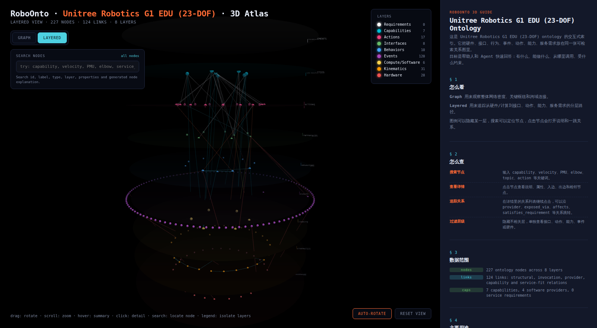

# roboonto

[](https://github.com/zengury/roboonto/actions/workflows/ci.yml)
[](LICENSE)


[English](README.md) · **中文**

一个把机器人厂商资料(URDF、SDK、手册)转化为**可查询、agent 就绪的本体**的工具链——并附带特定机器人的第一方本体 pack。

**文档:** [快速上手](docs/zh/QUICKSTART.md) · [规范](docs/zh/SPEC.md) · [MCP 接入](docs/zh/MCP.md) · [Agent 就绪度等级](docs/zh/ARL.md) · [能力层](docs/CAPABILITY_LAYER.md) · [数据来源](SOURCES.md)

<p align="center">
  
  <br>
  <em>3D 本体图谱 —— 宇树 G1 EDU pack 汇成一张可检索的分层关系图
  (硬件 → 运动学 → 计算 → 事件 → 行为 → 接口 → 动作 → 能力)。
  打开 <a href="robots/unitree_g1_edu/roboonto_pack_3d.html"><code>robots/unitree_g1_edu/roboonto_pack_3d.html</code></a> 查看可交互版本。</em>
</p>

```
厂商资料 ──► [ roboonto 导入器 ] ──► YAML 本体 ──► [ api ] ──► 你的 agent / runtime
                                          ▲               ▲
                                          │               │
                                    日志/mcap ──► [ 摄取器 ] ──► [ 诊断 ]
```

## 你会得到什么

- **一个工具**(本仓库):导入器、本体 API、日志摄取器、参考诊断。
- **Packs**(`robots/` 目录):每台机器人一个本体。

## 状态

| | |
|---|---|
| 版本 | v0.4.0 — G1 感知 + 3D 图谱 |
| 覆盖机器人 | 智元 X2 · 宇树 G1 EDU · HalfCheetah(仿真) |
| Pack 评分 | X2 **customer-ready 100/100** · G1 **customer-ready 100/100**([ARL-3](docs/zh/ARL.md)) |
| X2 pack 内容 | 256 对象 · 22 动作 · 403 关系 · 11 能力 |
| X2 3D 图谱 | `robots/agibot_x2/roboonto_pack_3d.html` |
| 测试 | 107 |
| Python | 3.10+ |

## 安装

```sh
pip install roboonto
```

机器人 pack(G1、X2 等)在本仓库中——克隆以获得完整本体和示例:

```sh
git clone https://github.com/zengury/roboonto
cd roboonto
pip install -e .
```

可选,用于日志摄取:
```sh
pip install pyyaml mcap mcap-ros2-support
```

## 使用

### 查询本体

```python
from roboonto.api.loader import OntologyLoader
from roboonto.api.query import Query

ontology = OntologyLoader("robots/agibot_x2").load()
q = Query(ontology)

# 左臂有哪些关节?
for j in q.objects_of_type("Joint"):
    if j["id"].startswith("agibot_x2.kin.joint.left_arm"):
        print(j["id"], j["properties"]["effort_limit"])

# LOCOMOTION_DEFAULT 模式下允许哪些动作?
for a in q.actions_allowed_in_mode("LOCOMOTION_DEFAULT"):
    print(a["type_id"], a.get("safety_class"))

# 机器人能做什么,agent 应该怎么调用?
for affordance in q.agent_affordance_menu(capability_kind="navigation"):
    print(affordance["name"], [a["id"] for a in affordance["actions"]])
```

### 能力优先的 agent 查询

```sh
python3 -m roboonto.cli query robots/agibot_x2 agent-affordances navigation
python3 -m roboonto.cli query robots/agibot_x2 service-fit agibot_x2.req.safe_base_motion
python3 -m roboonto.cli infer-capabilities robots/agibot_x2 --yaml
```

能力层把「机器人能做什么」和「怎么调用」分开:

```
SoftwareComponent / Sensor
  -> provides_capability -> Capability
  -> exposed_via -> Topic / Service / Action
  -> satisfies_requirement -> ServiceRequirement
```

详见 [`docs/CAPABILITY_LAYER.md`](docs/CAPABILITY_LAYER.md)。

### 标准对齐

RoboOnto 保持自己的工程化 YAML 格式,同时 v0.3 能力层显式映射到机器人本体标准:

- **IEEE 1872.2 / AuR**:锚定自主能力、任务、自主系统、环境等自主机器人概念。
- **IEEE 1872.1 / CORA**:锚定机器人、执行器、传感器等核心机器人术语。
- **RoSO**:锚定组件、功能、感知、驱动、参数等服务化概念。

映射存放在每个 pack 的 `standard_mappings.yaml` 及对象级 `standard_mappings` 字段中,作为 agent 与工具的词汇锚点——RoboOnto 本身仍是加载、查询、校验、CLI、MCP 与 3D 可视化的操作性 schema。此为参考性(informative)对齐,非合规认证声明。

### 3D 本体图谱

用浏览器打开 `robots/agibot_x2/roboonto_pack_3d.html` 可交互式查看 X2 本体:`Graph` 全关系网络模式、`Layered` 分层模式(硬件/计算/接口/动作/能力/需求)、节点搜索、关系溯察与一跳导航。

### 校验动作调用

```python
from roboonto.api.action_validator import ActionValidator

v = ActionValidator(ontology)
report = v.check(
    "set_forward_velocity",
    params={"forward_velocity": 0.05, "source": "test"},
    state={"mc_action": "LOCOMOTION_DEFAULT", "is_moving": False,
           "registered_input_sources": ["test"]},
)
# report.failures 解释了前置条件为何不满足
```

### 摄取会话日志

```sh
python3 -m roboonto.tools.log_ingestor \
    /path/to/session_dir \
    --robot agibot_x2 \
    --output ./output \
    -v
```

读取 `bag/`、`info/`、`log/` 子目录,支持 `.mcap`、`.atop`、`.log`、`.yaml`、`.json`,产出 `session.summary.json` + `coverage.report.md` + `stats.json`。

## 目录结构

```
roboonto/
├── roboonto/              工具代码
│   ├── core/              元 schema(定义什么是合法本体)
│   ├── api/               loader · query · action validator
│   ├── importers/         URDF · SDK 文档 · ...
│   └── tools/             日志摄取器 + 读取器(mcap、atop)
├── robots/                本体 packs
│   └── agibot_x2/         硬件 · 运动学 · 能力 · 接口 · 行为 · 事件 · 动作 · 派生关系
├── skills/                运维知识(通用 · 人形 · 实例)
├── docs/                  规范 · 快速上手 · MCP · ARL · 质量方法论
├── examples/              快速上手脚本
└── tests/
```

## 设计

本仓库刻意分开两样东西:

- **档案**(`robots/`):描述机器人「是什么」的 YAML,按机器人独立版本化。
- **引擎**(`roboonto/`):加载、查询、校验、摄取的 Python 代码,与具体机器人无关。

**来源溯源是强制的。** 每个本体对象都带 `source` 字段:`document`(含定位)、`urdf_import`、`log_observation`(含置信度)等。多来源断言显式标注,绝不隐藏。

深入阅读:[`docs/zh/SPEC.md`](docs/zh/SPEC.md)、[`docs/ONTOLOGY_QUALITY_METHODOLOGY.md`](docs/ONTOLOGY_QUALITY_METHODOLOGY.md)。

## 路线图

- v0.4 — ACL(Agent 合规度)一致性测试框架 · 仿真就绪度 profile · 诊断引擎 MVP
- v0.5 — pack 注册表 · 第三个机器人 pack
- v1.0 — Web 仪表盘 · CLI 完整性

## 许可

代码与 schema:[Apache-2.0](LICENSE)。机器人 pack 包含从公开厂商资料中提取的事实性规格——各 pack 的来源与更正政策见 [SOURCES.md](SOURCES.md)。
